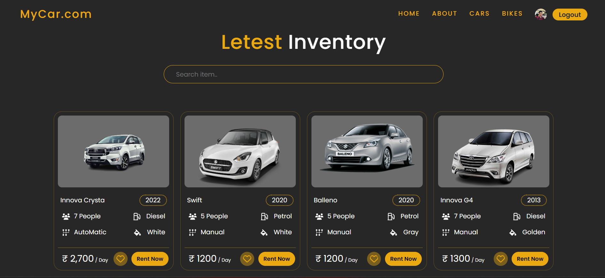

# React + Vite
git clone #githublink
npm i
npm run dev

This is my ongoing project: The Rent-a-Car website,
developed using React.js and Bootstrap for the frontend,
with Express.js for the backend, and MongoDB as the
database, ensuring robust data management and
efficient server-side operations. With a sleek interface,
users can effortlessly browse a diverse range of vehicles,
customize their rental preferences, and securely book
their desired car. Seamlessly integrating CSS and
JavaScript, this project demonstrates my proficiency in
front-end development and user-centric design,
showcasing my skills to potential employers

This template provides a minimal setup to get React working in Vite with HMR and some ESLint rules.

Currently, two official plugins are available:

- [@vitejs/plugin-react](https://github.com/vitejs/vite-plugin-react/blob/main/packages/plugin-react/README.md) uses [Babel](https://babeljs.io/) for Fast Refresh
- [@vitejs/plugin-react-swc](https://github.com/vitejs/vite-plugin-react-swc) uses [SWC](https://swc.rs/) for Fast Refresh
